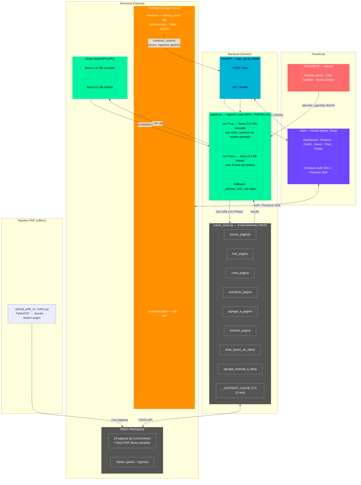

# Arquitectura del Sistema — Athena + Apex




## Estado de entregables — Fase 1 → Fase 3

| Fase | Sem | Entregable | Estado |
|------|-----|-----------|--------|
| **Fase 1** | 1 | Diseño de arquitectura del sistema | ✅ Completo (este diagrama) |
| **Fase 1** | 2 | Configuración del entorno (Firebase, Notion, Groq, Docker) | ✅ Completo |
| **Fase 1** | 3 | Primer reporte escrito | ⚠️ Pendiente (documento Word/PDF) |
| **Fase 2** | 4 | Streamlit UI — `app.py` | ✅ Completo |
| **Fase 2** | 5 | FastAPI backend — `app_api.py` | ✅ Completo |
| **Fase 2** | 6 | React Native app — Apex | ✅ Completo |
| **Fase 3** | 6 | Reporte de avance (arquitectura + UI) | ⚠️ Pendiente (documento) |
| **Fase 3** | 7 | Nuevas herramientas Notion: `listar_bases_de_datos` + `agregar_entrada_a_tabla` | ✅ Completo |
| **Fase 3** | 7 | Base de conocimiento PDF → Notion (7 documentos) | ✅ Completo |
| **Fase 3** | 8 | Panel configuración Streamlit (modo, idioma, historial) | ✅ Completo |
| **Fase 3** | 8 | Reporte técnico intermedio | ⚠️ Pendiente (documento) |
```
